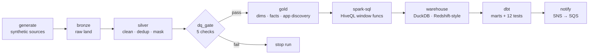

# Cloud Resource & Application Discovery Pipeline

A production-shaped **big-data ETL pipeline** that ingests cloud security telemetry
(VPC Flow Logs + CloudTrail API events + a resource inventory), cleans and
de-duplicates it with **Apache Spark**, applies **column-level data governance**
(classification + tokenization of confidential fields), models it into a
**dimensional warehouse**, and **discovers applications** by clustering resources
that talk to each other on the network. Orchestrated with **Apache Airflow**,
gated by an automated **data-quality** suite, and shipped with **CI**.

A self-contained portfolio project. It demonstrates a big-data data-engineering
stack end to end: Spark/EMR-style processing, Glue/Athena/Redshift-style modeling,
S3-style partitioned storage, SNS/SQS-style eventing, and Airflow orchestration.

## Architecture



## Data provenance — read this first
All data is **100% synthetic**. It is generated to match the **public field
schemas** of VPC Flow Logs (v2) and CloudTrail plus a simple resource
inventory. **It is not real data from any organization** and contains no real
customer, account, or security information. Synthetic data is used purely to
exercise the pipeline at
realistic record scale; the schemas, transforms, model, and tests are the point.

## One command to run
```bash
./run.sh            # full scale: 10M flow events + 2M API events + 50K resources
./run.sh sample     # tiny smoke run (same code path) — used by CI
make test           # unit tests
```
Requirements: Python 3.10+, Java 11, `pip install -r requirements.txt`. Spark is
configured to run in a single local JVM and spill to disk, so it runs on a laptop.

## Pipeline stages (medallion architecture)
1. **generate** — synthetic source data (labeled) → `data/raw` (partitioned Parquet)
2. **bronze** — faithful raw capture + ingest metadata → `data/bronze`
3. **silver** — clean, type-cast, **deduplicate**, **classify + mask** confidential
   fields (`owner_email`, `source_ip` → SHA-256 tokens) → `data/silver`
4. **dq_gate** — 5 automated checks; **pipeline stops if any fail** (nothing ships
   unverified)
5. **gold** — dimensional model (`dim_resource`, `dim_principal`,
   `fact_network_flow`, `fact_api_action`) + **application discovery**
   (connected components over the resource-to-resource flow graph)
6. **spark-sql** — HiveQL-compatible Spark SQL transforms (CTEs + `RANK()`
   window functions) → `principal_risk_ranked`, `resource_flow_ranked`
7. **warehouse** — load gold into a DuckDB warehouse (local stand-in for
   Redshift/Athena) + run optimized analytics SQL
8. **dbt** — `dbt build` materializes staging + mart models and runs 12 schema
   tests (not_null / unique / relationships) on `dbt-duckdb`
9. **notify** — publish a completion event to **Amazon SNS → SQS** (boto3;
   unit-tested with `moto`)

## Verified results (full-scale run, this machine: 4 vCPU / 3.8 GB RAM)
| Metric | Value |
|---|---|
| Input rows processed end-to-end | 12,350,000 |
| Wall-clock, generate→warehouse | 89 s (~139K rows/sec) |
| Flow rows in → out (dedup) | 10,300,000 → 10,000,000 (2.91% removed) |
| Data-quality checks | 5 / 5 PASS (gate exit 0) |
| Applications discovered | 1,232 (from 48,960 distinct network edges) |
| Discovery accuracy vs ground truth | V-measure 0.771 · purity 0.349 (honest, unsupervised) |
| Warehouse fact_network_flow | 10,000,000 rows |
| PII leakage after masking | 0 rows (independently verified) |

Numbers are reproduced independently in `docs/RESULTS.md` by a second engine
(DuckDB) reading the Parquet outputs directly.

## Layout
```
src/generate_synthetic_data.py   raw synthetic sources (labeled)
src/bronze_ingest.py             raw -> bronze
src/silver_transform.py          clean / dedup / govern+mask
src/dq_checks.py                 data-quality gate
src/gold_model.py                dimensional model + application discovery
src/spark_sql_transforms.py      HiveQL-compatible Spark SQL (window functions)
src/warehouse_load.py            load to DuckDB + analytics
src/verify_independent.py        2nd-engine (DuckDB) verification incl. accuracy
src/notify.py                    SNS->SQS completion event (boto3)
dbt/                             dbt-duckdb project: staging + marts + schema tests
dags/asset_discovery_dag.py      Airflow DAG (generate->...->dbt->notify)
sql/analytics_queries.sql        optimized analytics SQL
sql/redshift_ddl.sql             Redshift DDL + Iceberg variant
tests/test_transforms.py         unit tests (dedup, masking, governance)
tests/test_notify.py             SNS/SQS tests via moto
ci/github-actions.yml            tests + sample end-to-end run + dbt build
config/pipeline.yml              scale + paths + DQ thresholds
docs/                            RESULTS, EXECUTIVE_SUMMARY, ARCHITECTURE
```
