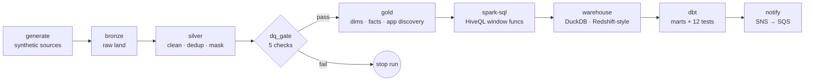
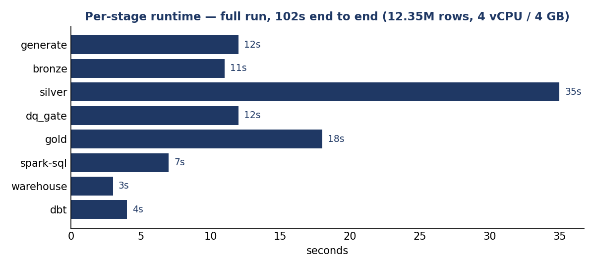
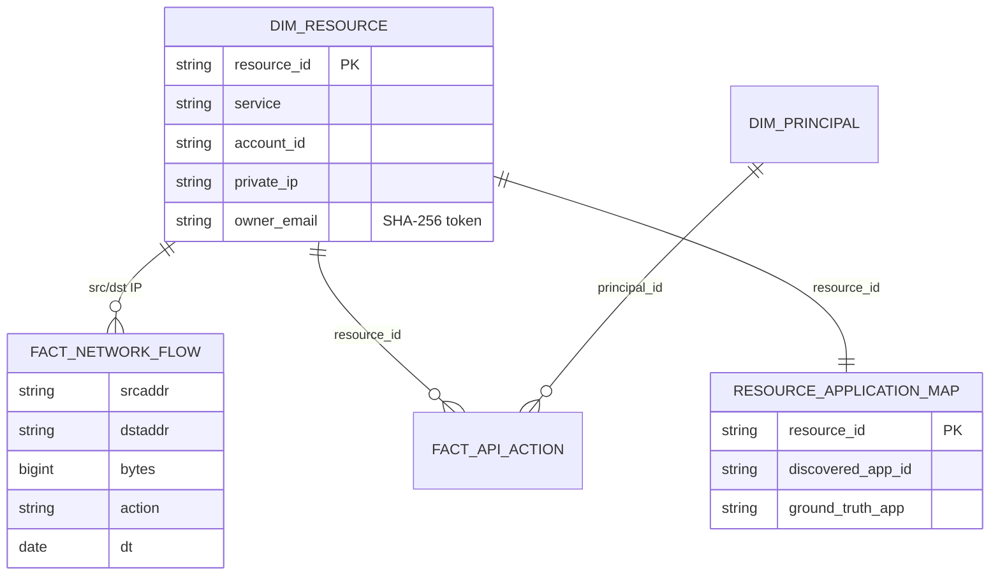
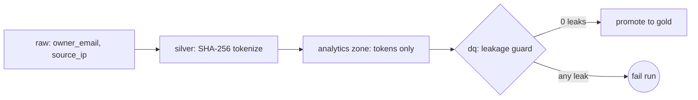
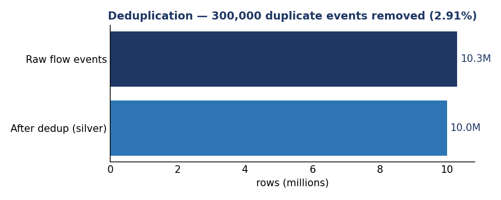
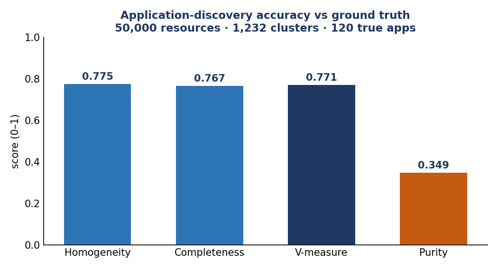

<h1 align="center">Cloud Resource &amp; Application Discovery Pipeline</h1>

<p align="center">
  A production-shaped, big-data ETL pipeline that ingests cloud security telemetry,
  governs PII, models it into a warehouse, and <b>discovers applications</b> from network
  behavior - built end to end with Spark, Airflow, dbt, and a Redshift-style warehouse.
</p>

<p align="center">
  
  
  
  
  
  
  
  
</p>

---

## Why this project exists

You can only secure what you can see. In a large cloud estate, no single dataset says
*what resources exist, which ones talk to each other, who acts on them,* and *which
belong to the same application.* This project builds that map automatically: it takes
three raw sources - network flow logs, API-activity logs, and a resource inventory -
and turns them into a governed, queryable, **application-level** view of the estate,
with the data-quality and confidentiality controls a security data platform requires.

It is a **portfolio project**: the engineering is real and runs end to end; the data is
100% synthetic (see [provenance](#-data-provenance)).

### At a glance
- **12.35M records** processed end to end in **~100 seconds** on a 4-vCPU / 4-GB box.
- **Medallion architecture** (bronze → silver → gold) in **Apache Spark (PySpark)**.
- **Automated data-quality gate** (5 checks) that **blocks promotion on failure**.
- **Confidential-data governance**: column classification + SHA-256 tokenization, with a
  leakage guard that fails the run if any PII reaches the analytics zone.
- **Application discovery** via connected-components graph clustering, **scored against
  ground truth** (V-measure 0.77).
- **Apache Airflow** DAG, **dbt** models + 12 schema tests, **SNS→SQS** eventing (boto3),
  and **CI** - every headline number **independently re-verified with a second engine (DuckDB)**.

---

## 🏗️ Architecture



<p align="center"></p>

---

## 🔒 Data provenance

All data is **100% synthetic**. It is generated to match the **public field schemas** of
VPC Flow Logs (v2) and CloudTrail plus a simple resource inventory. **It is not real data
from any organization** and contains no real customer, account, or security information.
Synthetic data exists only to exercise the pipeline at realistic record scale - the
schemas, transforms, model, governance, and tests are the point.

---

## What it demonstrates

| Capability | Where in the repo |
|---|---|
| Big-data ETL at scale (Spark) | `src/generate_synthetic_data.py`, `bronze_ingest.py`, `silver_transform.py` |
| Data modeling / warehousing (star schema) | `src/gold_model.py`, `sql/redshift_ddl.sql` |
| Data quality & integrity gate | `src/dq_checks.py` |
| Confidential-data governance (masking) | `src/silver_transform.py` |
| Spark SQL / HiveQL (window functions) | `src/spark_sql_transforms.py` |
| Orchestration | `dags/asset_discovery_dag.py` (Airflow) |
| Analytics engineering (dbt models + tests) | `dbt/` |
| Event-driven notification (SNS→SQS) | `src/notify.py` |
| Independent verification (2nd engine) | `src/verify_independent.py` |
| CI | `.github/workflows/ci.yml` |

---

## Pipeline stages

| # | Stage | What it does | Output |
|---|---|---|---|
| 1 | **generate** | Synthetic VPC-flow / CloudTrail / inventory sources (labeled) | `data/raw/*` (partitioned Parquet) |
| 2 | **bronze** | Faithful raw capture + ingest metadata | `data/bronze/*` |
| 3 | **silver** | Type-cast, **deduplicate**, **classify + mask** confidential fields | `data/silver/*` |
| 4 | **dq_gate** | 5 checks (null-rate, uniqueness, referential integrity, leakage). **Stops the run on failure.** | pass/fail |
| 5 | **gold** | Dimensional model + **application discovery** + accuracy scoring | `data/gold/*` |
| 6 | **spark-sql** | HiveQL CTEs + `RANK()` window functions (principal risk, resource flow) | `data/gold/*_ranked` |
| 7 | **warehouse** | Load gold into a DuckDB warehouse + optimized analytics SQL | `data/warehouse/discovery.duckdb` |
| 8 | **dbt** | Build staging + mart models, run 12 schema tests | `dbt/dbt_warehouse.duckdb` |
| 9 | **notify** | Publish a completion event to **SNS → SQS** (boto3) | event |

---

## 🧱 Data model (gold)



---

## 🛡️ Confidential-data governance

Two columns are classified **CONFIDENTIAL** (`owner_email`, `source_ip`) and tokenized
with SHA-256 in the silver layer, so joins still work but raw PII never enters the
analytics zone. The data-quality gate includes a **leakage guard** that fails the whole
run if any plaintext PII is detected downstream.



<p align="center"></p>

---

## 🔎 Application discovery &amp; accuracy

Applications are discovered by building the resource-to-resource graph from accepted
network flows and running **connected-components** clustering. Because every synthetic
resource carries a ground-truth `app_id`, the discovered clusters are **scored** against
that label (computed in `gold_model.py`, reproduced by the DuckDB verifier).

<p align="center"></p>

**Honest reading:** V-measure ~0.77 is solid - the clustering recovers real structure -
but purity ~0.35 is modest: connectivity alone over-fragments apps into ~10× more clusters
than exist (1,232 vs 120), so any single cluster only partly matches its true app. This is
expected for unsupervised connected-components on a noisy graph and is reported as-is.
Weighting edges by flow volume or applying community detection is the natural next step.

---

## ✅ Verified results

Full-scale run (config in `config/pipeline.yml`), 4 vCPU / ~4 GB RAM, single local Spark JVM:

| Metric | Value |
|---|---|
| Input rows processed end to end | **12,350,000** |
| Wall-clock (generate → dbt) | **~102 s** |
| Flow rows in → out (dedup) | 10,300,000 → 10,000,000 (2.91% removed) |
| Data-quality checks | **5 / 5 pass** (gate exit 0) |
| Applications discovered | 1,232 (from 48,960 distinct edges) |
| Discovery V-measure / purity | **0.771 / 0.349** |
| dbt models + tests | **19 / 19 pass** (7 models + 12 schema tests) |
| Unit tests | **5 / 5 pass** (transforms, masking, SNS/SQS via moto) |
| PII leakage after masking | **0 rows** (independently verified) |

### Independent verification (second engine)
Every headline number is recomputed straight off the Parquet with **DuckDB** - no shared
code with the Spark pipeline. Run it yourself:

```bash
python src/verify_independent.py
# → dedup, duplicates, PII leakage, appmap integrity, and discovery accuracy
#   QA VERDICT: PASS
```

---

## ☁️ Local → production mapping

| This repo (runs on a laptop) | Production equivalent |
|---|---|
| PySpark local + Spark SQL / HiveQL | Amazon EMR / AWS Glue (HiveQL runs unchanged) |
| Partitioned Parquet on disk | Amazon S3 + Glue Data Catalog |
| DuckDB warehouse + dbt-duckdb | Amazon Redshift / Athena + dbt |
| `src/notify.py` (boto3 SNS→SQS, moto-tested) | Amazon SNS publish / SQS delivery |
| `sql/redshift_ddl.sql` | Redshift DDL + Apache Iceberg tables |
| Airflow DAG | Amazon MWAA (Managed Airflow) |

---

## 🚀 Quickstart

```bash
# Requirements: Python 3.10+, Java 11, then:
pip install -r requirements.txt

./run.sh sample     # fast smoke run (tiny data, same code path) - great first run
./run.sh            # full scale: 10M flow events + 2M API events + 50K resources

make test           # unit tests (pytest)
python src/verify_independent.py   # second-engine (DuckDB) verification
python scripts/make_charts.py      # regenerate the README charts from a run
```

Spark is configured to run in a single local JVM and **spill to disk**, so it runs on a
laptop; the same stages fan out across a cluster on EMR/Glue unchanged.

---

## 📁 Repository layout

```
src/
  generate_synthetic_data.py   synthetic sources (labeled)
  bronze_ingest.py             raw -> bronze
  silver_transform.py          clean / dedup / govern + mask
  dq_checks.py                 data-quality gate (blocks on failure)
  gold_model.py                dimensional model + app discovery + accuracy
  spark_sql_transforms.py      HiveQL-compatible Spark SQL (window functions)
  warehouse_load.py            load to DuckDB + analytics
  verify_independent.py        2nd-engine (DuckDB) verification incl. accuracy
  notify.py                    SNS -> SQS completion event (boto3)
dbt/                           dbt-duckdb project: staging + marts + 12 schema tests
dags/asset_discovery_dag.py    Airflow DAG (generate -> ... -> dbt -> notify)
sql/                           optimized analytics SQL + Redshift/Iceberg DDL
tests/                         unit tests (transforms, masking, SNS/SQS via moto)
scripts/make_charts.py         regenerate README charts from real metrics
ci/github-actions.yml          tests + sample end-to-end run + dbt build
docs/                          EXECUTIVE_SUMMARY, RESULTS, ARCHITECTURE, img/
config/pipeline.yml            scale + paths + DQ thresholds
```

---

## 🧪 Testing &amp; CI

- **Unit tests** (`tests/`): dedup logic, irreversible PII masking, and SNS→SQS delivery
  (mocked with `moto`).
- **dbt tests**: `not_null`, `unique`, and `relationships` across staging + marts.
- **Data-quality gate**: runs inside the pipeline and fails the run on any breach.
- **CI** (`.github/workflows/ci.yml`): unit tests, sample end-to-end run, independent verification, and `dbt build`.

---

## 🔭 Limitations &amp; roadmap

- Data is synthetic (public cloud-log schemas), not real production data.
- "Scale" is demonstrated at 10M+ rows with disk spill on one machine, not at cluster/PB
  scale - the code is written to run unchanged on EMR/Glue.
- Discovery uses connected components on accepted flows; **next steps**: weight edges by
  flow volume, add community detection, and lift purity above the current 0.35.

---

## License

[MIT](LICENSE) © 2026 Vijay Shankar Chamakuri
